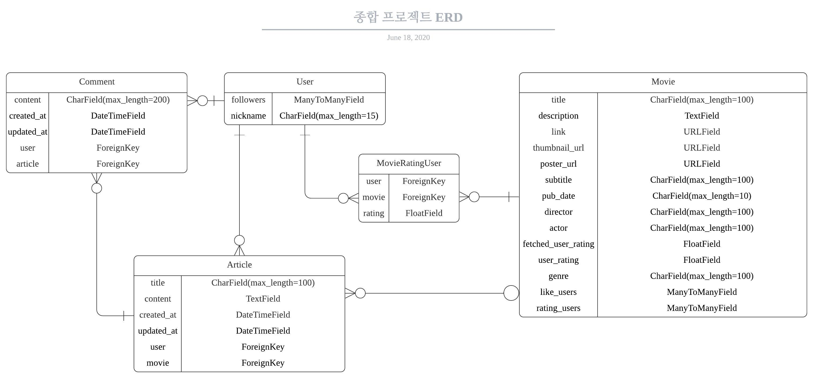

# SSAFY 3기 종합 프로젝트 - 영화 추천 사이트

## - DRF & Vue.js (Vuex)

* **DRF Rest API 서버에 대한 문서는 final_pjt_drf 내부에 있습니다.**

### 1. 팀원 정보 및 업무 분담 내역

- 팀원: 0346887 서용준 & 0346113 김태형
- 기본적으로 두 사람 다 프론트, 백 양쪽을 모두 같이 개발한다.
- 서용준: 영화 데이터 수집 및 가공. ERD 작성. README 정리. 배포. Vue.js 총괄.
- 김태형: DRF 계정, 게시글, 댓글 로직 작성. 영화 추천 알고리즘 작성.

### 2. 필수 기능, 목표 서비스 및 실제 구현 정도

1. **필수 기능**
   
   1. 관리자뷰
   2. 영화정보
   3. 추천 알고리즘
   4. 커뮤니티
   5. 기타 (상태코드, 메시지)
   
2. **목표 서비스**

   1. 계정정보 (회원가입, 로그인, 로그아웃, 관리자설정, 회원 탈퇴 & user detail)
   2. 영화 정보 받아서 db에 받아오기 (영화정보 저장)
   3. 영화 정보 보여주기 (list, detail, like)
   4. 커뮤니티 만들기 (list, detail, comment, pagination)
      - 영화 디테일 페이지에서 커뮤니티로 넘어가는 링크를 만들어준다.
   5. 유저 팔로잉 - 팔로우하는 유저 들어가서 좋아요 한 영화 목록 조회할 수 있게끔 & 링크 타면 해당 영화 디테일 페이지 갈 수 있게끔
   6. 영화 추천 알고리즘 
      1. 오늘 날씨를 기반으로 한 추천 알고리즘
         - 오늘 날씨 정보를 받아와 그 날마다 날씨에 맞는 영화들을 선택하여 추천해준다.
      2. 유저의 영화 좋아요 버튼을 기반으로 한 추천 알고리즘
         - 만약 유저가 어떤 영화에 대해 좋아요를 누르면, 그 영화의 장르를 파악하여 같은 장르의 영화들을 추천해준다.
      3. 평점을 기반으로 한 추천 알고리즘
         - 네이버 평점을 API를 통해 받아와서, 네이버 평점이 높은 순으로 나열하여 영화를 추천해준다.
   7. 회원 정보 수정
      - 비밀번호 변경 기능을 구현한다.
      - 회원 탈퇴하는 기능을 구현한다.
   8. 영화 추천 알고리즘 다듬기
3. **실제 구현**

   1. 계정정보
      - django-allauth, django-rest-auth를 활용하여 회원가입, 로그인, 로그아웃 기능을 구현했다.
      - 회원 상세페이지는 UserSerializer를 만들어서 정보를 전송하는 방식으로 구현했다.
   2. 영화정보 저장
      - 먼저 영화진흥원 api에서 영화목록을 조회했다. 장편 영화인 경우에 한해 해당 영화의 제목을 네이버 영화 api의 query로 보내고, 받은 응답에서 items에 있는 내용을 db에 담도록 했다. 네이버 영화 api의 items에 있는 내용과 영화진흥원의 장르를 함께 저장했다.
      - 영화진흥원 api에서 장르에 '성인물'이 들어가는 경우 해당 영화를 제외했고, 네이버 성인 검색어 판별 api를 통해 성인 검색어로 판별되는 경우에도 해당 영화를 제외했다. 그리고 네이버 영화 평점이 0.00점이거나 10.00점인 경우의 영화도 모두 제외했다. 또한, 받은 데이터에 빈 값이 있는 경우도 제외했다.
      - BeautifulSoup을 사용하여 영화 줄거리와 포스터 URL을 크롤링해온 후 영화 데이터에 함께 저장했다.
      - 총 15,000개 가량의 영화 정보를 영화진흥원 api를 통해 받은 후, 필터링을 통해 1700개의 영화 데이터를 데이터베이스에 저장했다.

   3. 영화 정보 보여주기

      - 영화 리스트는 모든 영화에 대해서 vuetify를 사용하여 카드 형식으로 보여주었다. 또한 영화의 수가 많기 때문에 Pagination을 활용하여 영화 리스트를 보여주었다.
      - 영화 디테일 페이지에는 기본적으로 영화제목, 네이버 평점, 줄거리, 포스터, 감독, 배우 등의 데이터를 보여주었고, GOTCHA만의 평점을 기록할 수 있고 평점을 수정할 수도 있게 구현해 놓았다. 다른 사람이 평점을 추가하면 평균값을 계산하여 반환해서 보여주었다. 또한 아래에는 그 영화의 네이버 영화 페이지로 갈 수 있는 링크를 버튼으로 구현해 추가하였다.
      - 영화 디테일 페이지에서 좋아요를 표시할 수 있게 나타내주었다. 좋아요를 누른 상태이면, 하트 속이 채워진 하트로 표시가 되고, 좋아요를 누르지 않은 상태면 하트 속이 비어있는 상태로 표시가 되게 하였다. 또한, 하트 아이콘 옆에 총 몇 명의 사람들이 이 영화에 좋아요를 눌렀는지 표시해주었다.

   4. 커뮤니티 만들기

      - 게시글 목록 페이지를 만들어서 게시글을 전부 받아와 최신의 글이 가장 위로 올라가게 정렬을 한 후, 마찬가지로 Pagination을 활용하여 제목, 닉네임, 작성시간, 수정시간, 영화제목(선택한 경우) 만 보여지게 글 목록을 작성하였다.
      - 게시글 디테일 페이지에서는 그 게시글에 대한 모든 정보를 보여주었다. 게시글을 작성 시에는 어떤 영화에 대한 게시글인지 표시할 수 있게끔, 검색창에서 영화를 검색하여 선택할 수 있게 구현하였다. 또한, 게시글은 작성자만이 수정, 삭제가 가능하고 이 때 선택하였던 영화를 변경할 수도 있다.
      - 게시글을 작성할 때, 게시글 목록에서 새로 작성하여도 되지만, 영화 디테일 페이지에서 게시글을 바로 작성하러 갈 수 있는 버튼을 만들어 놓았다. 이 버튼을 통해 게시글 작성 페이지로 들어오게 되면 영화 선택란이 자동으로 그전의 영화로 채워져있다.
      - 댓글들은 게시글 디테일페이지 아래에 가장 최신에 작성된 댓글이 가장 위로 올라오게끔 정렬을 하여 보여주었다. 댓글의 수정, 삭제는 마찬가지로 댓글 작성자만이 할 수 있다.

   5. 영화 추천 알고리즘

      1. 오늘 날씨를 기반으로 한 추천 알고리즘
         - requests와 BeautifulSoup을 이용하여 네이버 서울 날씨를 크롤링 해 온다. 날씨를 크게 세 분류(맑음, 흐림, 비)로 나누어서 각 날씨마다 장르를 지정해준다. 그 후, 오늘 날씨에 맞는 장르의 영화들을 Django ORM을 통해 데이터베이스에서 선택해주었고, 선택된 영화들을 프론트엔드로 넘겨주었다.
      2. 유저의 영화 좋아요 버튼을 기반으로 한 추천 알고리즘
         - 영화마다 좋아요 유저가 좋아요 버튼을 누를 수 있도록 구현하였다. 그 후, 유저가 어떤 장르의 영화들에 좋아요를 눌렀는지 파악하여 가장 좋아요를 많이 누른 장르 2개를 파악하였다. 그 후, 두 개의 장르의 영화들을 Django ORM을 통해 데이터베이스에서 선택해주었고, 선택된 영화들을 프론트엔드로 넘겨주었다.(만약 좋아요를 누른 적이 없다면 전체 영화 중 랜덤으로 선택하여 보여주었다.)
      3. 평점을 기반으로 한 추천 알고리즘
         - 영화들의 네이버 평점을 데이터 테이블안에 넣어주었기 때문에, 네이버 평점을 기준으로 하여 내림차순으로 데이터를 정렬한 후(평점이 높은 순), 정렬된 영화 데이터들을 프론트엔드로 넘겨주었다.

   6. 회원정보수정

      - 비밀번호 변경은 기존에 사용하고 있는 rest-auth 패키지에 이미 등록이 되어 있는 함수이므로, 비밀번호 변경 양식인, 현재 비밀번호와 새로운 비밀번호를 입력하게 한 후, rest-auth에서 지정한 주소로 POST요청을 보내주어서 비밀번호를 변경하였다. 이때 비밀번호를 변경해도 로그인이 풀리지 않게끔 따로 설정해주었다.
      - 회원 탈퇴기능은 rest-auth 패키지에서 제공하지 않으므로 직접 작성하였다. 유저의 pk값을 DELETE요청으로 받으면 django ORM을 통해 해당 객체를 선택하고 데이터베이스에서 삭제해주었다. 이 때 rest-auth를 사용 중이면 이상하게 오류가 발생하는데 이것을 해결하기 위해서는 rest-auth에서 제공하고 있는 social login 기능을 사용하지 않아도 settings.py에 추가해주고 해당 기능이 동작하도록 구현해주어야 했다. 회원 탈퇴가 성공적으로 이뤄지면 DB에서 해당 레코드를 완전히 삭제해주었다.

### 3. 데이터베이스 모델링(ERD)

- 한 영화를 좋아하는 유저가 많을 수 있고, 한 유저가 많은 영화를 좋아할 수도 있으니 Movie 모델의 like 필드를 통해 User와 M:N관계로 연결된다.
- 영화에 따른 게시글이 있을 수도 있고 없을 수도 있으며, 있다면 영화와 게시글이 1:N관계로 연결된다.
- 게시글은 User가 필수적으로 있어야하고, 한 유저가 많은 게시글을 쓸 수 있으므로 User와 Article이 1:N관계로 연결된다.
- 댓글은 게시글이 필수적으로 있어야 하고, 한 게시글에 많은 댓글이 있을 수 있으므로 게시글과 댓글은 1:N관계로 연결된다.
- 댓글은 유저도 필수적으로 있어야 하고 한 유저가 많은 댓글을 남길 수 있으므로 유저와 댓글은 1:N관계로 연결된다.
- 유저의 필드는 기본적으로 django의 AbstractUser에서 받아오고, 임의로 추가해준 필드만 ERD상에 나타내었다.

### 4. 배포 서버 URL

- DRF Rest API Server: https://serene-garden-95240.herokuapp.com (Heroku)
- Vue.js: gotcha-ssafy304.xyz (Netlify)
